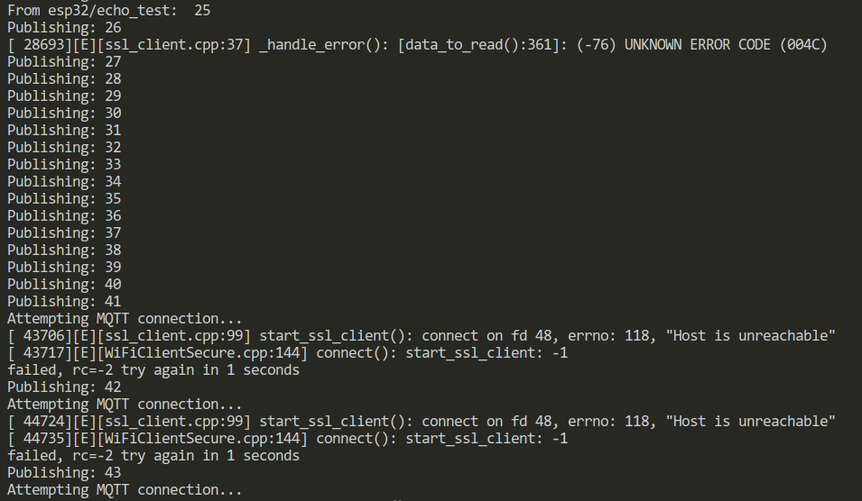

## Bố trí thí nghiệm 
- Tạo 1 broker miễn phí trên HiveMQ
    + Sau khi tao thành công 1 broker miễn phí trên HiveMQ, tiếp tục tạo 1 username và password rồi Connect
  
    + Thêm topic cần Subcirbe và chọn QoS tương ứng
   
- Dùng thư viện PubSubClient trên ESP32 kết nối với một MQTT Broker (trên đám mây hoặc local đều được).
- Sử dụng thư viện Ticker, một thư viện chuẩn trong Arduino để gọi hàm publish một cách đều đặn và bất đồng bộ, mỗi giây (1s) một lần:
    + Mã: `mqttPulishTicker.attach(1, mqttPublish)`
    + Tài liệu về Ticker: https://docs.arduino.cc/libraries/ticker/, https://github.com/espressif/arduino-esp32/blob/master/libraries/Ticker/src/Ticker.h 
- Subscribe tới topic `esp32/echo_test` ngay sau khi MQTT connect thành công
- Gọi hàm `mqttClient.loop()` trong main loop để handle các thông điệp nhận được từ broker (bất đồng bộ, event driven) bất kỳ lúc nào. 
- Phát hiện mất kết nối MQTT `if (!mqttClient.connected())` trong main loop để kết nối lại `mqttReconnect()` ngay khi phát hiện mất kết nối.

## Kịch bản thí nghiệm

- Sau khi ESP32 khởi động, sẽ kết nối WiFi vào một điểm phát AP đã định (ssid, và pass trong secrets/wifi.h) --> thành công
- Sẽ thấy MQTT Client kết nối đến broker thành công và bắt đầu gửi (publish) và nhận (subscribe) số đếm tăng dần trong `echo_topic` đều đặn
- Khi đó sẽ tiến hành ngắt điểm phát WiFi, tiện nhất là phát wifi từ điện thoại để bật ngắt nó nhanh chóng trong tầm tay
- Quan sát phản ứng của MQTT Client trong mã khi mất kết nối WiFi giữa chừng, 
- sau đó bật lại điểm phát WiFi và quan sát khả năng khôi phục kết nối, và quan sát việc mất gói tin trong quá trình kết nối.

## Mục đích 
- Xem việc ngắt kết nối từ bên dưới chồng Internet Protocol có ảnh hưởng tới lớp trên không. Ở đây là lớp WiFi (link layer) bị ngắt --> lớp TCP/IP bị ngắt --> có ảnh hưởng tới lớp ứng dụng MQTT trên cùng hay không? ESP core lib sẽ in ra thông điệp lỗi như nào (có báo lỗi từ lớp dưới lên lớp bên trên hay không?)
- Quan sát sự bỏ mặc việc mất thông điệp trong QoS = 0. 
- Hiểu rõ hơn về cơ chế hoạt động của MQTT client bên trên tầng TCP/IP, nhất là cơ chế phát hiện mất kết nối và khôi phục kết nối ở lớp vật lý, rất hay xảy ra trong thực tế.

## Kết quả
Quan sát thông điệp in ra theo thời gian ta thấy một vài điều thú vị ngoài dự kiến như sau:

**Hình 1**

1. Thư viện PubSubClient có thể gọi hàm publish trước khi thiết lập kết nối thành công với broker
- Sau khi kết nối WiFi thành công, thì `Attempting MQTT connection...` mất khoảng 3s để thiết lập kết nối (mỗi lần publish là 1s).

2. Thông điệp đầu tiên mà ESP32 nhận được từ broker chính là cái `retained message` từ lần thí nghiệm trước (số 99):
- Xem **Hình 1**
- Do logic của mã thông thường là sẽ subscribe vào các topic mà client quan tâm ngay sau khi thiết lập kết nối MQTT thành công, ở đây ta đã subscribe vào `echo_topic` cho nên đã nhận được thông điệp "còn sót lại cuối cùng" (retained message) từ broker. 

3. Cơ chế Echo hoạt động bình thường như dự kiến, kể cả với QoS 0:
- Trên **Hình 1**
- Điều này không có gì lạ, vì khi mội kết nối được thiết lập thì lớp TCP/IP truyền thông điệp rất tốt 
- Không quan sát thấy bị mất gói tin lần nào kể cả việc publish và subscribe với QoS = 0. 

**Hình 2**

4. Khi ngắt điểm phát WiFi (AP):
- **Hình 2** ngắt tín hiệu từ bộ phát WiFi - ví dụ: trên điện thoại, giữa chừng khi ESP32 đang publish thông điệp 26 (xem hình 2).
- Ngay lập tức ssl_client ở lớp dưới trên con ESP32 báo lỗi (ssl_client.cpp:37 ...)
- Sau đó thì thư viện PubSubClient vẫn tiếp tục publishing thông điệp 1s mỗi lần, từ 27 tới 41 (đúng 15s).
- 15s sau thì MQTT Client mới phát hiện ra việc mất kết nối MQTT và tiến hành `mqttReconnect` --> báo lỗi `failed, rc=-2`
- Tra cứu trên docs của PubSubClient thì thấy lỗi này có nghĩa là: `-2 : MQTT_CONNECT_FAILED - the network connection failed`
- .. điều này có nghĩa là tới lúc này thì MQTT Client phát hiện ra mất kết nối mạng (sau 15s) và tiến hành kết nối lại.
- Việc kết nối lại không thành công cho đến khi ta bật điểm phát WiFi lại.
- Như trên **Hình 3** việc kết nối MQTT khôi phục mất khoảng 3s sau khi kết nối WiFi khôi phục (không in thông điệp kết nối WiFi connected do logic của mã thí nghiệm). 
- Note: điều này cũng chứng tỏ là thư viện WiFi.h của ESP32 trên Arduino Core nó sẽ tự động xử lý việc kết nối WiFi lại một cách im lặng, không cần người dùng phải viết mã. Nếu muốn bạn có thể tự nghiên cứu kỹ hơn về hiện tượng này bằng mã trong thư mục thí nghiệm "Wifi_Connect_Experiment" cùng trên Repo này. 

**Hình 3**

## Kết luận 

Việc "làm các thí nghiệm" trong công nghệ lập trình là vô cùng hữu ích ở nhiều phương diện:

- hiểu rõ hơn về tương tác của các thành phần trong mã
- hiểu rõ hơn về các trường hợp không được nói trong tài liệu nhưng có thể xảy ra trong thực tế (edge cases)
- giúp người lập trình hiểu rõ hơn về API của các thư viện mình sắp dùng 
- cũng là quá trình tiếp cận các thư viện và công nghệ mới hiệu quả vì nó cần phải động não mà cũng khá đơn giản.

